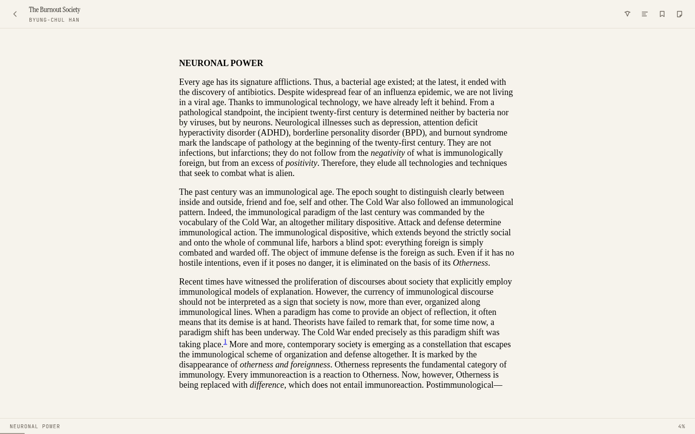
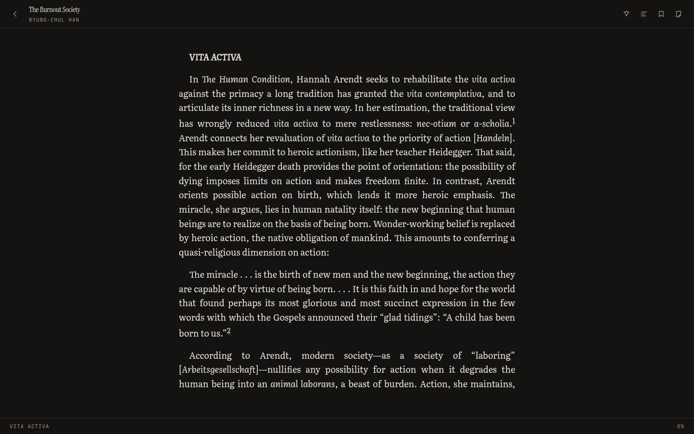
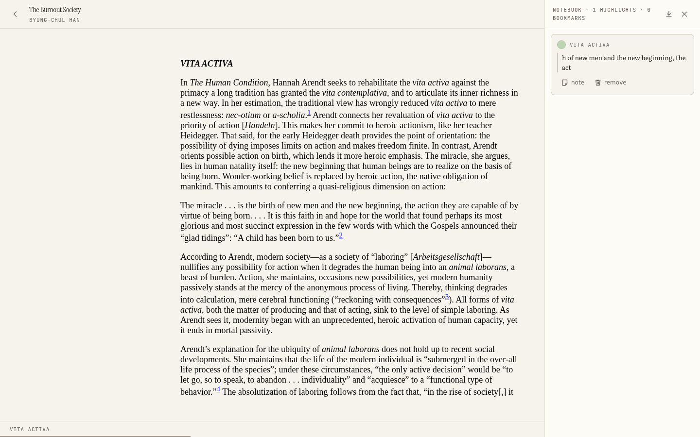
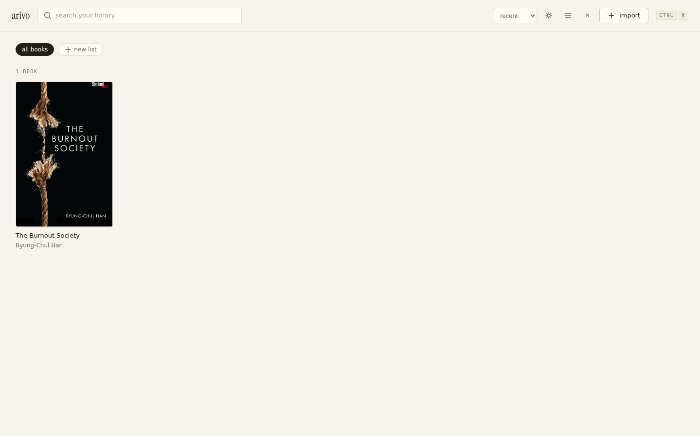

<div align="center">

# arivo

**a reading environment. local-first. your library is yours.**

*import · read · highlight · note · bookmark · search · export*

</div>

---

every reader i tried held my library hostage. cloud accounts that own your
annotations. databases you can't open. export as a feature, not a right.

arivo is the answer, built as files:

```
~/Arivo/
└── library/
    └── {book}/
        ├── book.epub
        ├── cover.jpg
        ├── metadata.json
        └── annotations.json     ← the truth, human-readable, portable
```

zip that folder and hand it to any future app — everything reconstructs.
the sqlite index is a cache; delete it and arivo rebuilds from the folders,
zero loss. **data is a right, not a feature.**

## what it does (v0.1)

- **library** — drag epubs and pdfs in, covers and metadata extracted,
  collections, tags, continue-reading, three cover sizes, grid or list
- **reading** — epub.js reflowable with literata typography (five sizes,
  1.65 leading, real margins), three themes (paper / sepia / night),
  paginated or scrolled, progress restored on open
- **annotating** — select text → a quiet glass menu → five colors, notes,
  bookmarks; the notebook panel lists everything and jumps back to it
- **search** — ctrl+k palette across titles, authors, highlights, notes
  (fts5)
- **export** — markdown reading notes per book
- **pdf** — fixed-layout reading with zoom/fit, page bookmarks, and
  text-layer highlights when the pdf has a text layer (scanned pages get
  page bookmarks, honestly labeled)

## what it looks like

| the library | reading, paper | reading, night |
| --- | --- | --- |
|  |  |  |

| a highlight, the notebook, the jump | the real app, headless smoke |
| --- | --- |
|  |  |

## install

windows: download `Arivo-<version>-setup.exe` from releases. mac/linux:
build from source.

## develop

```bash
pnpm install
pnpm dev          # the app, with hot reload
pnpm dev:web      # the renderer in a browser (mock backend)
pnpm check        # typecheck + lint + tests
pnpm smoke        # headless boot + screenshot
pnpm dist:win     # the windows installer
```

see [AGENTS.md](./AGENTS.md) for the full agent protocol, and
[docs/CONSTITUTION.md](./docs/CONSTITUTION.md) for the laws.

## the stack

electron 44 · react 19 · typescript (strict) · vite 7 · epub.js ·
pdf.js · better-sqlite3 (index only) · zustand · pnpm workspaces.

## roadmap

- v0.2 — sync (optional, bring-your-own supabase), calibre import,
  reading statistics, annoyance-log fixes
- v0.3 — work/edition model, more export formats, full typography control
- later — the knowledge layer, the ai companion (promotion-gated, provenance
  forever) — only after the reading experience is perfect

## license

mit
